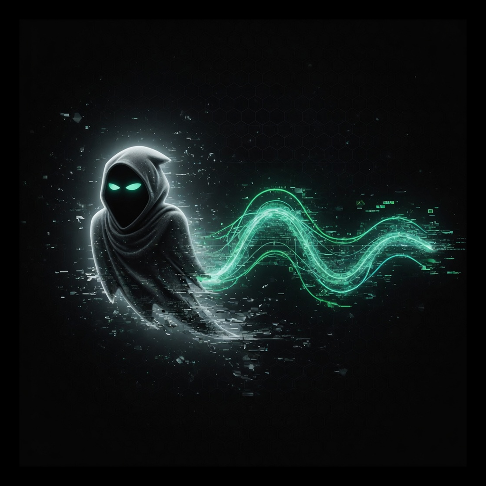
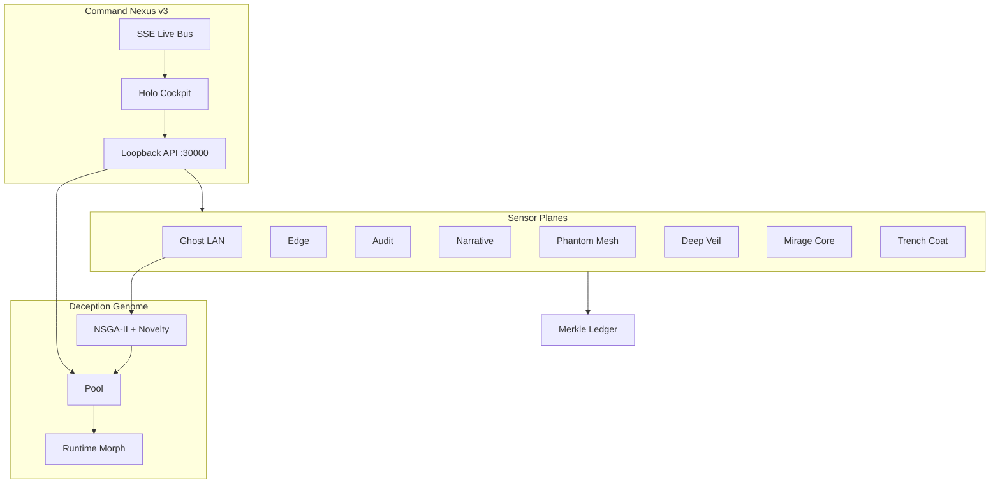

# Ghost Continuum v3.0 — OMEGA ASCENDANT

<p align="center">
  
</p>

<p align="center">
  
  
  
  
  
  
</p>

> *Static honeypots fingerprint. Living deception adapts. The immune system watches back.*

**Ghost Continuum** is a local-first **Living Digital Immune System** — polymorphic deception that breeds, morphs, remembers, and seals. Version **3.0 OMEGA ASCENDANT** elevates the public Command interface and operator polish so the sophistication of the fabric is visible at [ghost.jonbailey.xyz](https://ghost.jonbailey.xyz/) while keeping every sacred constraint intact.

```
listen · breed · morph · remember · seal · evolve · contain
```

```bash
git clone https://github.com/Pitchfork-and-Torch/ghost-continuum.git
cd ghost-continuum
npm run setup
npm start
# → http://127.0.0.1:30000  COMMAND NEXUS
```

**Requirements:** Node.js 18+. **Core engine: zero npm dependencies.** UI optionally loads Three.js from CDN for WebGL (canvas 2D fallback when offline).

**Public site:** https://ghost.jonbailey.xyz/ · **Preview:** https://ghost.jonbailey.xyz/hub/

---

## What's new in v3.0 OMEGA ASCENDANT

| Pillar | Capability |
|--------|------------|
| **Public Nexus** | Immersive landing — holographic hero map, interactive plane explorer, client lifecycle demo |
| **Home Shield path** | Wizard-first narrative for home lab and family networks |
| **Install UX** | Copy-to-clipboard quickstart, multi-platform notes, first-5-minutes walkthrough |
| **Efficacy story** | Gauges and sparklines (demo on public site; live in Command Nexus) |
| **Cockpit polish** | Version truth, deeper void palette, Ghost Voice feedback, reduced-motion map orbit |
| **Packaging** | Optional Docker / compose; complete CHANGELOG and deploy docs |

Deep dive: [docs/OMEGA-v3.md](docs/OMEGA-v3.md) · [docs/OMEGA-v2.md](docs/OMEGA-v2.md) · [CHANGELOG.md](CHANGELOG.md)

---

## Inherited from v2.0 OMEGA IMMUNE

| Pillar | Capability |
|--------|------------|
| **Holographic Map** | True 3D wireframe grid, glowing nodes, pulsing threat paths, plane shells, predictive cones, orbit/zoom/pan |
| **Threat Efficacy** | Multi-metric gauge + sparkline (containment, response, deception rate, false positives) |
| **Sentinel Morphs** | STEALTH / RESEARCH / AGGRESSIVE / FORENSIC |
| **Forensic Time Machine** | Scrubber, event markers, ghost past states, branch sim, sealed replay export |
| **Ghost Voice** | Web Speech input + calm synthesis · NL over local event stream |
| **NSGA-II Genome** | Multi-objective evolution + novelty · Chad leaderboard · phylogeny |
| **Live fabric** | SSE push + polling · Merkle-traceable state |
| **Demo campaign** | One-click synthetic attack timeline |
| **Trench Coat plane** | Opt-in privacy cloak monitor |
| **Home Shield** | Wizard, kid mode, quiet hours, device trust, weekly report, alerts, PWA |

---

## First 5 minutes — enter the cockpit

1. `npm start` → open **http://127.0.0.1:30000**
2. Click **DEMO** — inject a sealed campaign (scanner → C2 → breach → isolation → evolution)
3. **Drag** the holographic map · **scroll** to zoom · **double-click** a node
4. Hit **AGGRESSIVE** — watch the fabric recolor and guardians intensify
5. Scrub the **Forensic Time Machine** — reconstruct the path
6. Type (or speak): `show me last 24h scanners`
7. **EVOLVE POOL** — NSGA-II crowns a new Chad Alpha
8. **SEAL INCIDENT** — Merkle-backed export for the courtroom
9. Open **HOME SHIELD** wizard if this is a home or lab network

---

## Home Shield (home & lab operators)

Not only for experts. Home Shield gives:

- Setup profiles (one PC, UniFi, pfSense, Cloudflare site, apartment, IoT, full lab)
- Kid mode and quiet hours
- Plain-language chrome vs expert labels
- Optional Discord / Telegram / webhook / Home Assistant alerts
- Weekly report and progression badges
- PWA install for the Command Nexus

---

## Why this hits different

| Layer | What it actually does |
|-------|------------------------|
| **Deception Genome** | GA + **NSGA-II**, fitness from real engagements, runtime morph fragments |
| **Ghost LAN** | Polymorphic LAN honeypots — NAS, routers, cameras; hot persona swap |
| **Edge Plane** | Cloudflare Worker tripwires, score-triggered morph |
| **Command Nexus** | Holographic 3D map, Time Machine, Ghost Voice, efficacy cockpit |
| **Trust Fabric** | Tamper-evident Merkle ledger, sealed `.tgz`, STIX/TAXII 2.1 |
| **Extended Planes** | Phantom Mesh · Deep Veil · Mirage Core · Narrative Weave · **Trench Coat** |
| **Predictive layer** | Statistical next-TTP cones + morph what-if |

Most honeypots sit still and hope. Ghost Continuum **evolves**, **correlates**, **predicts**, and **seals evidence**.

---

## Architecture



---

## Bundled packages

| Package | Role |
|---------|------|
| `packages/ghost-lan` | Polymorphic LAN honeypots |
| `packages/edge` | Worker tripwires |
| `packages/genome` | Schema, classic GA, **NSGA-II**, morph fragments |
| `packages/continuum` | Nexus, morphs, metrics, **holo-map model**, predictive |
| `packages/trust` | Merkle ledger, STIX/TAXII |
| `packages/narrative` | Echo realities, Ollama bridge (opt-in) |
| `packages/planes` | Mesh / Veil / Mirage / Trench registry |
| `packages/hub-api` + `hub-ui` | Loopback API + **OMEGA Command Nexus** |
| `landing/` | Public cinematic site for ghost.jonbailey.xyz |

---

## Sentinel morphs

| Morph | Profile | Map signature |
|-------|---------|---------------|
| `stealth` | Minimal footprint | Dim links, heavy fog |
| `research` | Max telemetry (default) | Neon cyan fabric |
| `aggressive` | Fast rotation, trap-heavy | Magenta bloom, guardians |
| `forensic` | Ledger priority, sealed exports | Green dashed forensics |

`POST /api/continuum/morph` `{ "morph": "aggressive" }` — reconfigures continuum + pushes SSE.

---

## API surface (highlights)

| Endpoint | Power |
|----------|-------|
| `GET /api/omega/status` | Cockpit compact status |
| `GET /api/continuum/holo-map` | 3D scene graph for the holographic map |
| `GET /api/events/stream` | SSE live events |
| `GET /api/continuum/predict` | Threat cones |
| `POST /api/continuum/what-if` | Morph simulation |
| `GET /api/continuum/genome/leaderboard` | Chad board + phylogeny + landscape |
| `POST /api/genome/evolve` | NSGA-II by default (`classic: true` for v1 GA) |
| `POST /api/demo/campaign` | Inject demo attack timeline |
| `POST /api/continuum/query` | Natural language over events |
| `POST /api/incident/export` | Sealed `.tgz` + SHA-256 provenance |
| `GET /api/continuum/taxii` | TAXII 2.1 collection |

Hub binds **127.0.0.1 only**. Mutating routes require `hubToken`. Exploit roles blocked at the gate.

---

## UI dependencies (justified)

| Dependency | Justification | Fallback |
|------------|---------------|----------|
| Three.js r160 (CDN) | WebGL holographic map | Canvas 2D projector in `holo-map.js` |
| Google Fonts (Orbitron/Rajdhani/IBM Plex) | Visual bible typography | System fonts |
| Web Speech API | Ghost Voice | Silent degrade |
| EventSource | Live morph/genome push | Polling every 4–6s |

**No npm packages are required to run the defensive core.**

---

## Deploy

| Target | Path |
|--------|------|
| Local stack | `npm start` |
| Public landing (CF Pages) | `npm run deploy:site` · [DEPLOY-JONBAILEY.md](docs/DEPLOY-JONBAILEY.md) |
| Cloudflare Edge + hub pages | `deploy/jonbailey/` |
| Optional Docker | `docker compose up --build` (loopback published) |
| Kubernetes | `deploy/helm/` |
| systemd / launchd / Windows | `deploy/systemd` · `deploy/launchd` · `deploy/windows` |
| Desktop shell | `apps/nexus-desktop/` (Tauri scaffold) |

---

## Related tools (Pitchfork-and-Torch)

| Project | Role |
|---------|------|
| [trench-coat](https://github.com/Pitchfork-and-Torch/trench-coat) | Multi-hop privacy cloak — Ghost can monitor / prefer cloak proxy when healthy |
| [NetForge suite](https://github.com/Pitchfork-and-Torch/netforge-windows) ([linux](https://github.com/Pitchfork-and-Torch/netforge-linux) · [macos](https://github.com/Pitchfork-and-Torch/netforge-macos)) | Host DNS/TCP hardening |
| [Fl1pp3r69](https://github.com/Pitchfork-and-Torch/Fl1pp3r69) | Manifest-driven Flipper field ops |
| [GrokLink OS](https://github.com/Pitchfork-and-Torch/GrokLink-OS) | Native multi-radio research RTOS |

---

## Ethos

- **Local-first** — intelligence stays on metal until you export
- **Defensive-only** — no offensive payloads; allowlisted scopes
- **Alive by design** — traps breed; personas morph; evidence seals
- **Auditable** — pure Node core, readable morph fragments (no `eval`)
- **Courtroom-grade memory** — Merkle ledger, sealed incidents

---

## FAQ

### Is Ghost Continuum offensive security tooling?

No. It is **defensive-only**: monitoring, deception, forensics, and local intelligence. No offensive payloads. Authorized networks only.

### Does it send data to the cloud?

Default posture is **local-first**. Exports and optional integrations are explicit; the core does not phone home.

### How does it relate to Trench Coat?

Trench Coat is **egress privacy** (Tor / multi-hop). Ghost is the **defense plane**. They can pair when a cloak proxy is healthy.

### What runtime does the core need?

Node.js 18+ with **zero core npm dependencies**.

---

## Support the work

Ghost Continuum is **free and open source**. Bug reports and feature requests are welcome via [GitHub Issues](https://github.com/Pitchfork-and-Torch/ghost-continuum/issues).

## License

MIT · see [LICENSE](LICENSE) · [SECURITY](SECURITY.md) · [LEGAL](LEGAL.md)

---

<p align="center"><em>When you open the Nexus, the network should watch back.</em></p>
