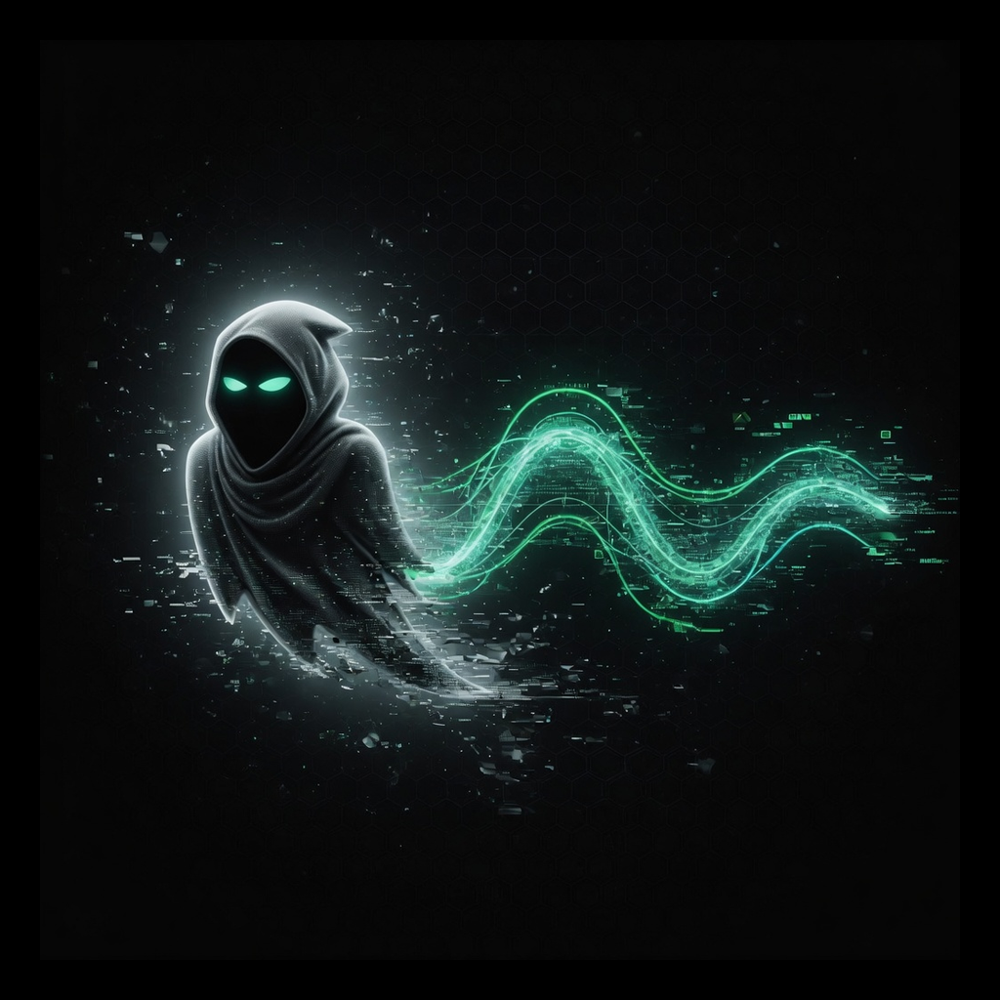
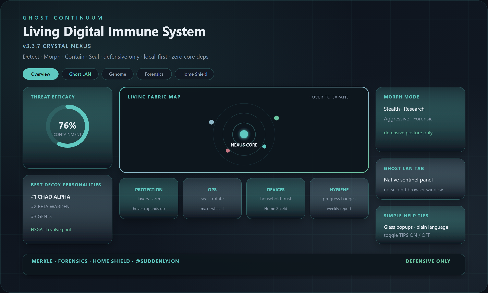
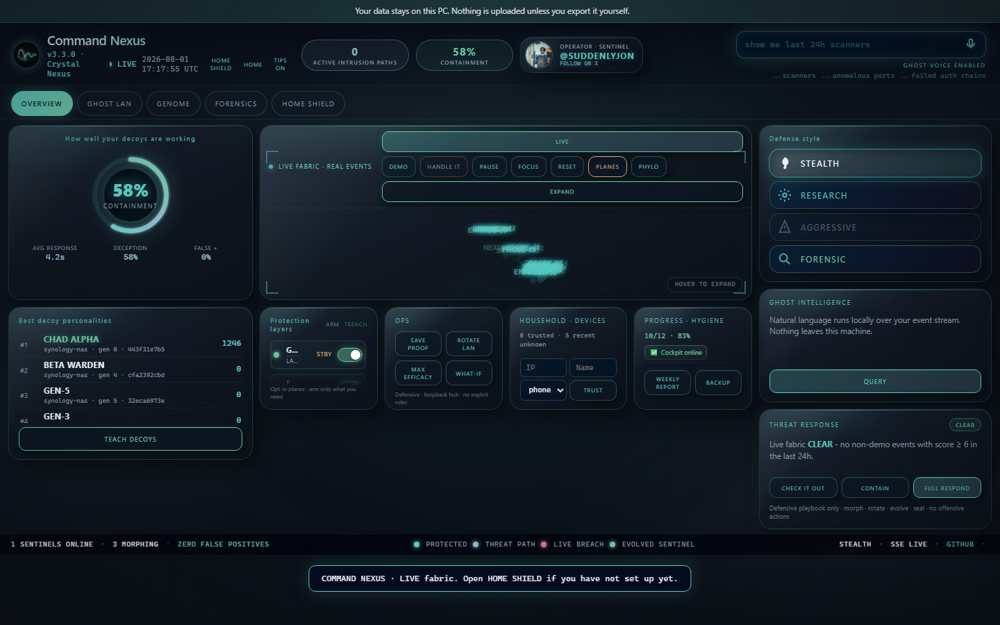

# Ghost Continuum v3.6.0 - Crystal Seal

<p align="center">
 
</p>

<p align="center">
 <a href="https://ghost.jonbailey.xyz/"></a>
 
 
 
 
 
 
</p>

> *The immune system that watches back.*

**Ghost Continuum** is a local-first **Living Digital Immune System**: polymorphic deception that evolves, morphs, contains, and seals. Version **3.6.0 Crystal Seal** adds a standalone HTML forensic replay and a local `seal` / `verify` CLI so Merkle-backed incident bundles can be opened offline and checked later — without changing defensive scope or zero-core-deps discipline.

```
listen · breed · morph · remember · seal · evolve · contain
```

```bash
git clone https://github.com/Pitchfork-and-Torch/ghost-continuum.git
cd ghost-continuum
npm run setup
npm start
# -> http://127.0.0.1:30000 Command Nexus
```

**Requirements:** Node.js 18+. **Core engine: zero npm dependencies.** UI may load Three.js from CDN for WebGL (canvas 2D fallback offline).

**Public site:** https://ghost.jonbailey.xyz/ · **Preview:** https://ghost.jonbailey.xyz/hub/

---

## What's new in v3.6.0 Crystal Seal

| Pillar | Capability |
|--------|------------|
| **Sealed replay** | Each SEAL writes `replay.html` — open offline, print to PDF, step with j/k |
| **Integrity** | Evidence hashed after write; portable `MANIFEST.json`; tamper fails verify |
| **CLI** | `ghost-continuum seal [label]` · `ghost-continuum verify [dir\|.tgz]` |

## What's new in v3.5.0 Crystal Membrane

| Pillar | Capability |
|--------|------------|
| **Command palette** | Ctrl/Cmd+K jump to views, LIVE/DEMO, RESPOND, evolve, seal |
| **Time-window queries** | last hour / 24h / 7d actually filter events; typed IPv4 AND-filter |
| **Keyboard cockpit** | 1-5 views, / focuses query, Esc closes palette then dossier |
| **Public site** | Landing copy + tweet card `?v=3.5.0` match the engine |

## What's new in v3.4.0 Crystal Membrane

Public site craft: brand island + X follow, visitor counter, 44px targets, tweet card, FAQ/HowTo schema.

## What's new in v3.3.7 Crystal Nexus

| Pillar | Capability |
|--------|------------|
| **Tabbed Nexus** | Overview · Ghost LAN · Genome · Forensics · Home Shield |
| **Hover-expand map** | Banner map grows to full center bento for clean node work |
| **Deck under map** | Protection · OPS · Devices · Hygiene (expand upward) |
| **Simple help** | Glass tips in plain language; TIPS ON/OFF |
| **Operator chip** | Follow @suddenlyjon on X |

## What's new in v3.2 Crystal Bento

| Pillar | Capability |
|--------|------------|
| **Crystal Bento layout** | Asymmetric membrane tiles: hero fabric map, efficacy, planes, morph, genome, timeline, Merkle strip |
| **Command Nexus polish** | Crystalline edges, membrane hover, gauge breath, refined tokens, progressive bento restack |
| **Static /hub/ preview** | Full bento showcase, FAQ JSON-LD, run-locally CTAs, SEO/AEO suite |
| **Architecture art** | Infographic + share cards aligned to Crystal Bento |
| **Docs** | Design system + visual changelog 3.2 |

## What's new in v3.1 Luminous Membrane

| Pillar | Capability |
|--------|------------|
| **Art direction** | Soft teal / pearl / warm charcoal; no pure void, neon HUD, or CRT scanlines |
| **Typography** | Self-hosted Fontshare Clash Display + Satoshi |
| **Public site** | Full design-token rewrite, membrane microinteractions, progressive disclosure |
| **Command Nexus** | Same premium language as the public site; quieter scientific instrument chrome |
| **Share cards** | 1200x630 OG / tweet cards regenerated for the new brand |
| **Architecture art** | Infographic and hub preview aligned to Luminous Membrane |
| **Docs** | Design system + visual changelog under `docs/` |

Deep dive: [docs/DESIGN-SYSTEM-LUMINOUS-MEMBRANE.md](docs/DESIGN-SYSTEM-LUMINOUS-MEMBRANE.md) · [docs/VISUAL-CHANGELOG-3.1-LUMINOUS-MEMBRANE.md](docs/VISUAL-CHANGELOG-3.1-LUMINOUS-MEMBRANE.md) · [CHANGELOG.md](CHANGELOG.md)

---

## Core capabilities (unchanged philosophy)

| Pillar | Capability |
|--------|------------|
| **Command Nexus** | Living fabric map, gauges, morphs, Forensic Time Machine, Ghost Voice |
| **Threat lifecycle** | Detect -> Morph -> Contain -> Seal (client demos + live hub) |
| **NSGA-II Genome** | Multi-objective evolution, leaderboard, phylogeny |
| **Sensor planes** | Ghost LAN, Edge, Audit, Narrative, Phantom, Deep Veil, Mirage, Trench Coat |
| **Home Shield** | Wizard, kid mode, quiet hours, device trust, weekly report, alerts, PWA |
| **Merkle forensics** | Sealed incidents, integrity chain |
| **Local-first** | Hub binds to 127.0.0.1 by default; no forced cloud |

Architecture diagram: [landing/infographic.svg](landing/infographic.svg)

---

## First 5 minutes

1. `npm start` → open **http://127.0.0.1:30000**
2. Click **DEMO** - inject a sealed synthetic campaign
3. Explore the fabric map · switch **Sentinel Morphs**
4. Scrub the **Forensic Time Machine**
5. Open **Home Shield** if this is a home or lab network
6. **SEAL INCIDENT** (or `ghost-continuum seal lab`) — open `replay.html`, then `ghost-continuum verify` on the folder

---

## Philosophy (non-negotiable)

- **Defensive only** - authorized networks you own or may defend
- **Local-first** - brain and data under `~/.ghost-continuum` by default; hub Host/Origin lock keeps the Command Nexus on loopback (see [SECURITY.md](SECURITY.md))
- **Zero core npm dependencies** for the engine (Node 18+ only)
- **Open source MIT** - auditable; no `eval`
- **No offensive capabilities**

See [LEGAL.md](LEGAL.md) and [SECURITY.md](SECURITY.md).

---

## Project layout

```
ghost-continuum/
 landing/ Public product site (source of truth for ghost.jonbailey.xyz)
 packages/hub-ui/ Command Nexus UI (local :30000)
 packages/hub-api/ Local hub API
 packages/core/ Zero-dep engine primitives
 packages/genome/ NSGA-II evolution
 packages/planes/ Defensive sensor planes
 deploy/jonbailey/ Cloudflare Pages deploy scripts
 docs/ Architecture, design system, changelogs
```

---

## Deploy public site

```bash
npm run deploy:site
# optional SEO ping:
npm run deploy:seo
```

---

## Screenshots

<p align="center">
 
</p>


<p align="center">
 
</p>

---

## License

MIT - see [LICENSE](LICENSE).

Pitchfork-and-Torch · https://ghost.jonbailey.xyz/
