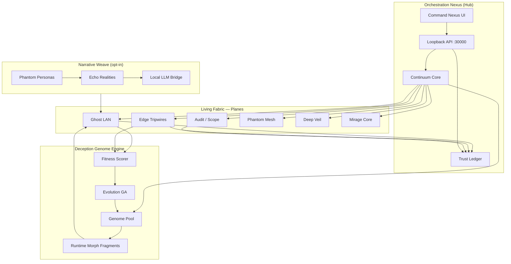
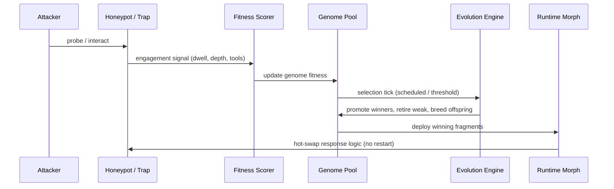
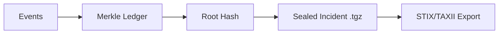

# The Living Deception Continuum — Architecture

> Ghost Continuum is not a honeypot — it is a **self-evolving polymorphic defense fabric**: genetic trap breeding, seven correlated sensor planes, and a Merkle-sealed forensic spine.

## System overview



## Plane evolution map

| Legacy (v0.2) | Continuum (v0.3+) | Role |
|---------------|-------------------|------|
| Ghost LAN | **Ghost LAN** + genome binding | Polymorphic LAN honeypots, dossiers, trap paths |
| Edge | **Edge** + narrative hooks | Tripwires, sentinel script, honeypot rotation |
| Audit | **Audit** + forensic replay | Authorized scope probes, validation |
| — | **Phantom Mesh** | Federated deception strategy sync (opt-in) |
| — | **Deep Veil** | eBPF kernel sensors (Linux, opt-in) |
| — | **Mirage Core** | Containerized high-interaction decoys (opt-in) |
| Hub | **Orchestration Nexus** | Single organism view, efficacy metrics, time machine |

## Deception Genome lifecycle



### Genome structure

Each genome is a JSON document with:

- **traits** — numeric behavioral parameters (delay bias, verbosity, chaff density)
- **personality** — archetype, tone, lore seed for narrative consistency
- **fragments** — safe, declarative morph instructions (no arbitrary eval)
- **fitness** — rolling engagement score from real interactions

Runtime polymorphism applies **fragment transforms** to response templates — string-safe mutations that change fingerprints without restarting listeners.

## Sentinel morphs

The continuum core operates in one of four **morphs** (configurable):

| Morph | Footprint | Logging | Behavior |
|-------|-----------|---------|----------|
| `stealth` | Minimal headers, bare responses | Quiet | Low interaction, high misdirection |
| `research` | Full polymorphism + dossiers | Verbose | Maximum telemetry for analysis |
| `aggressive` | Fast rotation, trap-heavy | Normal | Waste attacker time aggressively |
| `forensic` | Immutable ledger mode | Sealed | Merkle-backed replay preparation |

## Trust layer



All hub and plane events optionally append to a **tamper-evident Merkle ledger** at `~/.ghost-continuum/ledger/`. Incident bundles include ledger root + proof chain.

## Cognitive layer (opt-in)

When `continuum.narrative.enabled` is true and Ollama (or compatible endpoint) is reachable:

- **Phantom Personas** maintain per-IP conversation memory
- **Echo Realities** advance fake world state on a timeline (fake users, logs, emails)
- **Narrative Weave** ensures cross-plane consistency

Graceful degradation: without LLM, scripted persona templates and echo state still function.

## Safety rails (non-negotiable)

- Hub binds `127.0.0.1` only
- Allowlist enforcement on all scope operations
- Exploit operators blocked at hub
- Heavy features (LLM, eBPF, containers, 3D viz) are **opt-in**
- Self-improvement proposals require explicit human approval gate
- Zero runtime `eval()` — morph fragments are declarative only

## Command Nexus UI (v2.0 OMEGA IMMUNE)

The hub UI (`packages/hub-ui`) is the primary operator surface — a glassmorphic holographic cockpit:

| Module | Role |
|--------|------|
| `app.js` | Orchestration — SSE, gauge, morphs, timeline, Ghost Voice, NL |
| `holo-map.js` | Three.js WebGL holographic map (+ canvas 2D fallback) |
| `ghost-voice.js` | Web Speech API input/synthesis |
| `ui.css` | Neon glassmorphic visual system (visual bible) |

**Legacy modules** (`nexus-map.js`, `explainers.js`, `settings.js`) remain in tree for reference but are not loaded by the v2 shell.

**Map API:** `GET /api/continuum/holo-map` returns 3D scene graph (nodes with labels/states, connections, plane shells, predictive cones). Fallback: `GET /api/continuum/map-data` (v1).

**Live push:** `GET /api/events/stream` (SSE) for morph-switch, genome-evolved, map-invalidate.

**Genome:** `POST /api/genome/evolve` defaults to NSGA-II (`algorithm: 'nsga2'`); pass `classic: true` for v1 GA.

**Plane toggles:** Extended planes still via `POST /api/continuum/planes/toggle`.

See [OMEGA-v2.md](OMEGA-v2.md) and [MIGRATION-v2.md](MIGRATION-v2.md).

## Data directories

```
~/.ghost-continuum/
  config.json          # continuum + hub config
  events.jsonl         # unified event stream
  ledger/              # Merkle append-only log
  genomes/             # genome pool + lineage
  echo/                # echo reality state
  incident-snapshots/  # forensic exports

~/.ghost-lan/
  config.json
  state.json           # includes activeGenomeId
  events.jsonl
```

## Plugin architecture

Planes and modules register via `packages/planes/registry.js`. Community plugins export:

```js
export const plane = {
  id: 'my-plane',
  optIn: true,
  status: async () => ({ armed: false }),
  onEngagement: async (signal) => {},
};
```

The Nexus discovers plugins at runtime from `continuum.plugins` config paths.