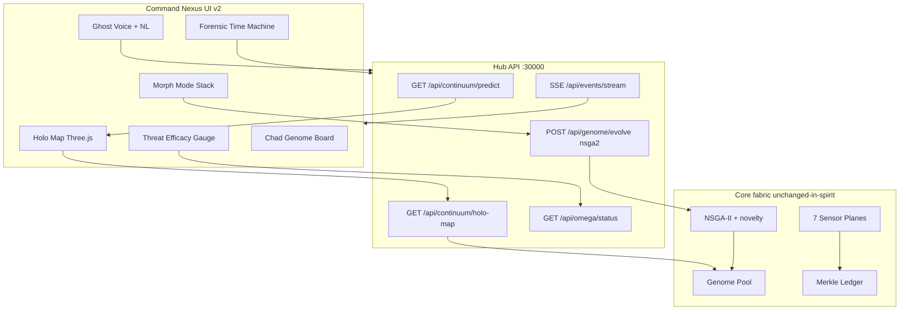

# Ghost Continuum v2.0 — OMEGA IMMUNE architecture

## High-level upgrade plan

```
v1.x living deception fabric
        │
        ▼
┌───────────────────────────────────────────────────────┐
│  OMEGA IMMUNE (v2.0)                                  │
│  · Holographic Command Nexus (WebGL + glass cockpit)  │
│  · NSGA-II multi-objective genome engine              │
│  · SSE real-time push bus                             │
│  · Predictive threat cones                            │
│  · Forensic Time Machine scrub + branch sim           │
│  · Ghost Voice (Web Speech) + enhanced NL             │
│  · Demo campaign generator                            │
└───────────────────────────────────────────────────────┘
```

## Architecture diff (v1 → v2)



## UI dependency justification

| Asset | Why | Fallback |
|-------|-----|----------|
| **Three.js r160 (CDN)** | True 3D holographic wireframe map, bloom-like emissive materials, orbit camera | Canvas 2D projected map in `holo-map.js` |
| **Orbitron / Rajdhani / JetBrains Mono (Google Fonts)** | Match visual bible typography | System UI fonts |
| **Web Speech API** | Ghost Voice in/out | Silent no-op |
| **EventSource SSE** | Instant morph/genome/map events | 4–6s polling |

Core Node engine remains **zero npm dependencies**.

## Data flow (live)

1. Planes emit events → `events.jsonl` + optional Merkle append  
2. Hub builds holographic scene (`buildHolographicScene` / `omegaDemoScene`)  
3. UI polls `/api/continuum/holo-map` + `/api/omega/status`  
4. Mutating actions publish SSE → UI invalidates map / narrates  
5. Scrubber uses `timeRange` + node timestamps for ghost replay  

## Security rails (unchanged)

- Bind `127.0.0.1` only  
- `hubToken` on POST  
- Exploit roles blocked  
- Defensive-only UI copy and LEGAL  

## Performance targets

- 60fps map with ≤200 nodes (LOD labels, particle cap, pixel ratio ≤2)  
- Status cache TTL ~2.5s  
- Holo-map cache TTL ~2.5s; bust on morph/evolve/demo  
