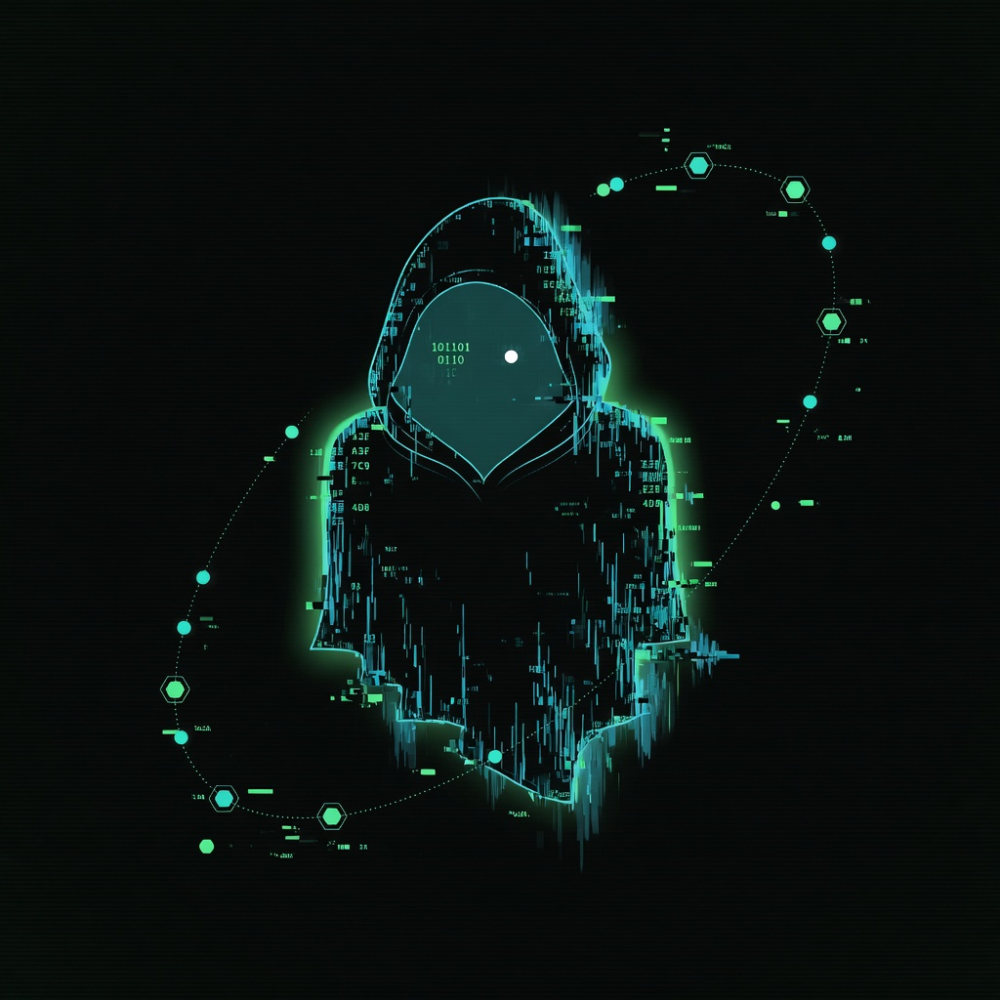

<p align="center">
  
</p>

<h1 align="center">GHOST LAN</h1>
<p align="center">
  <strong>Polymorphic deception layer for your home network</strong><br/>
  <code>listen · morph · beacon · vanish</code>
</p>

<p align="center">
  
  
  
  
</p>

---

```
   ░░░░░░░░░░░░░░░░░░░░░░░░░░░░░░░░░░░░░░░░░░░░░░░░░░░░░░░░░░░░░░░
   ░  GHOST LAN SENTINEL v0.2                                    ░
   ░  status: ARMED   persona: ROTATING   tripwire: OPTIONAL     ░
   ░░░░░░░░░░░░░░░░░░░░░░░░░░░░░░░░░░░░░░░░░░░░░░░░░░░░░░░░░░░░░░░
```

Your LAN shouldn't look like one machine. **Ghost LAN** makes it look like a shifting graveyard of NAS boxes, routers, cameras, and smart-home hubs — each probe fingerprinted with a **Marble-style polymorphic chain**. Defensive only. Local wire. No outbound attacks.

## Capabilities

| Layer | Behavior |
|-------|----------|
| **Honeypots** | HTTP decoy admin panels + TCP service banners |
| **Polymorphism** | Per-connection algorithm chains scramble bytes + headers |
| **Personas** | Synology · Router · Camera · Plex · Home Assistant |
| **Rotation** | Daily roll + morph every N honeypot hits |
| **DNS chaff** | Phantom `.lan` hostnames pinned to your box |
| **Tripwire** | Optional POST beacons to your edge worker |
| **Dashboard** | Live terminal UI → `http://127.0.0.1:29999` |

## Quick deploy

Ghost LAN ships inside [Ghost Continuum](https://github.com/Pitchfork-and-Torch/ghost-continuum) — recommended path:

```bash
git clone https://github.com/Pitchfork-and-Torch/ghost-continuum.git
cd ghost-continuum
npm run setup
npm start
```

LAN plane only (from repo root):

```bash
npm run ghost-lan
node packages/ghost-lan/bin/ghost-lan.js doctor
```

Config lives at `~/.ghost-lan/config.json` (created by `npm run setup`). See `config.example.json` for options.

## Boot persistence (Windows)

Installer tries **schtasks → ScheduledTask → Startup folder** — Administrator not required for autostart.

```powershell
node bin/ghost-lan.js install
# or
powershell -ExecutionPolicy Bypass -File install/install.ps1 -StartNow
```

Firewall rules (optional, needs Admin):

```powershell
powershell -ExecutionPolicy Bypass -File install/install.ps1 -Firewall
```

Uninstall:

```powershell
node bin/ghost-lan.js uninstall
```

## CLI

```
ghost-lan start [--foreground]   Launch sentinel (background default)
ghost-lan stop                   Graceful shutdown
ghost-lan status                 Persona · ports · hits
ghost-lan logs [--tail N]        Tail ~/.ghost-lan/events.jsonl
ghost-lan rotate                 Force persona morph
ghost-lan dashboard              Open local UI
ghost-lan chaff                  Print DNS chaff hosts
ghost-lan doctor                 Health check
ghost-lan install / uninstall    Register autostart hooks
```

## Config

`~/.ghost-lan/config.json` (see `config.example.json`):

```json
{
  "siteSeed": "my-home-lan",
  "lanIp": "192.168.1.100",
  "tripwireUrl": "",
  "beaconEnabled": false,
  "dashboardPort": 29999,
  "obviousPorts": [8080, 8443, 5901],
  "rotatingPortCount": 5,
  "rotateOnHits": 3
}
```

To enable remote alerting, set `tripwireUrl` to an HTTPS endpoint you control and set `beaconEnabled` to `true`. **Keep your tripwire URL out of git.**

## Architecture

```
  LAN scanner ──► :8080 / :8443 / :47xxx
                        │
                        ▼
              ┌─────────────────────┐
              │  GHOST LAN SENTINEL │
              │  HTTP traps │ TCP   │
              │  banners    │ dash  │
              └────────┬────────────┘
                       │ polymorphic encode (per-IP chain)
                       ▼
              ~/.ghost-lan/events.jsonl
                       │
                       ▼ optional POST
              your tripwire endpoint
```

## Data plane

```
~/.ghost-lan/
├── config.json          # operator config (local only)
├── state.json           # persona · generation · ports
├── events.jsonl         # append-only trip log
├── hosts-chaff.txt      # DNS deception export
├── sentinel.pid         # live process
└── launch-sentinel.cmd  # autostart launcher (after install)
```

## Safety

See [SECURITY.md](SECURITY.md). Summary:

- Honeypots bind to **your LAN** — never port-forward them
- Fake login forms go **nowhere**
- Rate-limited per source IP
- Beacons disabled by default
- Firewall installer scopes to `localsubnet` / private profile only

## Support the work

Ghost LAN is **free and open source** (bundled in Ghost Continuum). Bug reports via [GitHub Issues](https://github.com/Pitchfork-and-Torch/ghost-continuum/issues).

---

<p align="center">
  <sub>MIT License · defensive use only</sub>
</p>